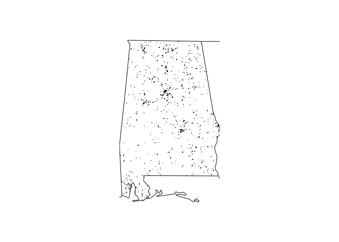

<!-- README.md is generated from README.Rmd. Please edit that file -->

# TestNewPackage

<!-- badges: start -->

<!-- badges: end -->

The goal of TestNewPackage is to test R with Github for the an
assignment in the ‘building R packages’ Coursera course.

## Installation

You can install the released version of TestNewPackage from
[CRAN](https://CRAN.R-project.org) with:

``` r
install.packages("TestNewPackage")
```

And the development version from [GitHub](https://github.com/) with:

``` r
# install.packages("devtools")
devtools::install_github("EV201/TestNewPackage")
```

## Accident statistics

The fars functions use the buildin databases: accident\_2013.csv.bz2,
accident\_2014.csv.bz2, accident\_2015.csv.bz2 You can access these
databases directly by system.file(“extdata”, filename, package =
“TestNewPackage”)

The fars functions show a summary of the accidents per month and year
(fars\_summarize\_years()) or the accidents for a year on a map for a
state (fars\_map\_state()). Only the years 2013-2015 can be used.

## Examples

``` r
library(TestNewPackage)
```

summarizing accidents for a year:

``` r
fars_summarize_years(2013)
#> # A tibble: 12 x 2
#>    MONTH `2013`
#>    <dbl>  <int>
#>  1     1   2230
#>  2     2   1952
#>  3     3   2356
#>  4     4   2300
#>  5     5   2532
#>  6     6   2692
#>  7     7   2660
#>  8     8   2899
#>  9     9   2741
#> 10    10   2768
#> 11    11   2615
#> 12    12   2457
```

or plotting the accidents for a year on a state map:

``` r
fars_map_state(1, 2015)
```



    #> [1] 0
